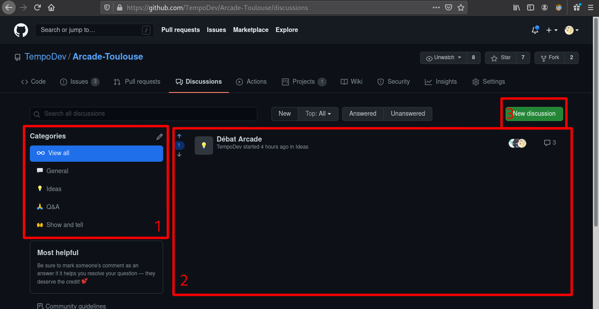
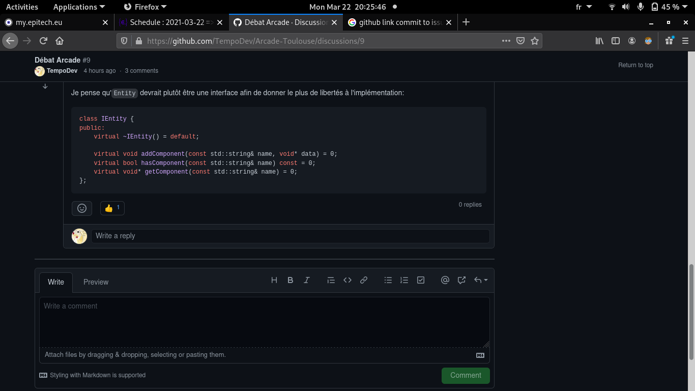
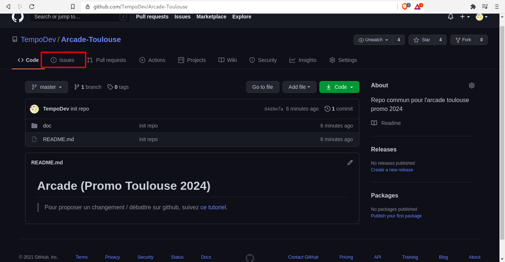
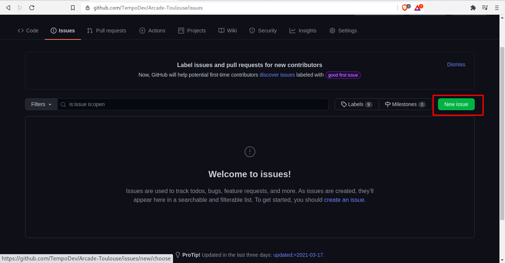
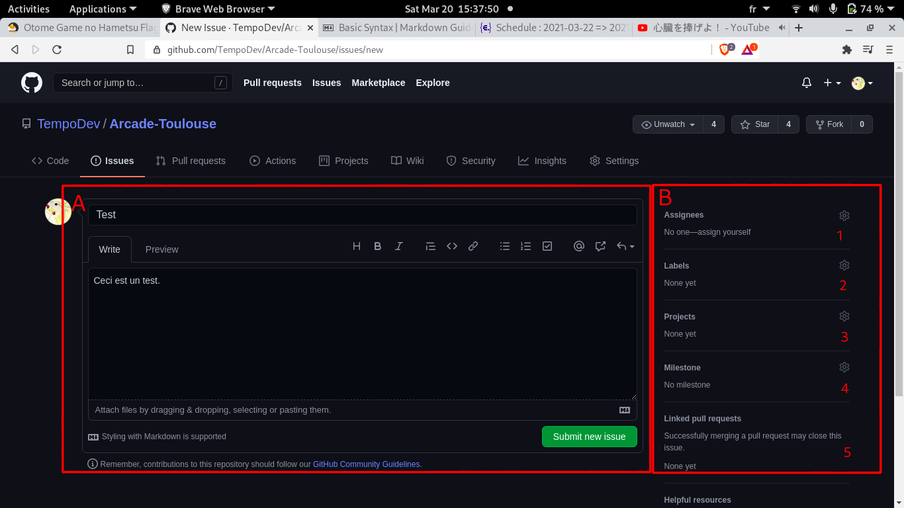
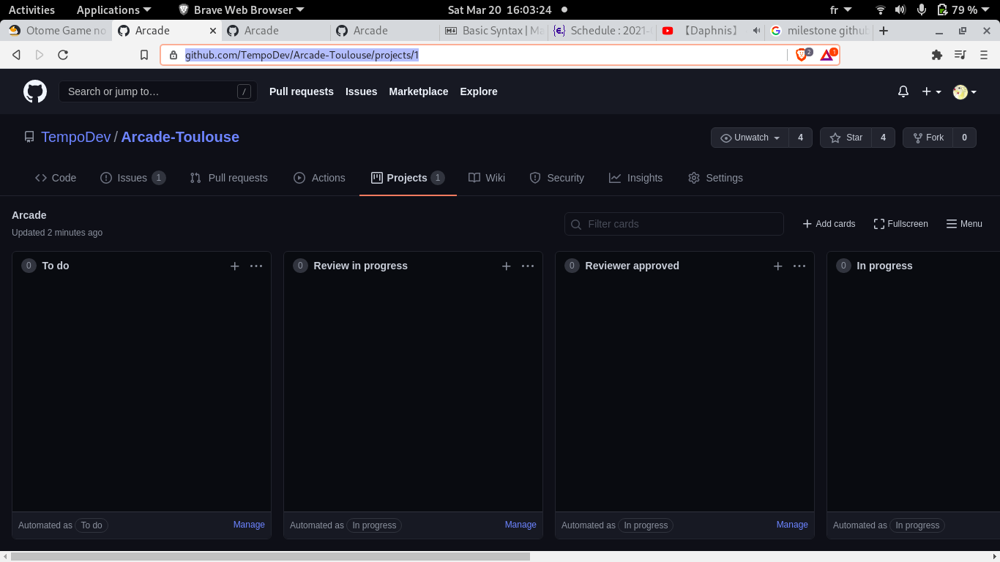
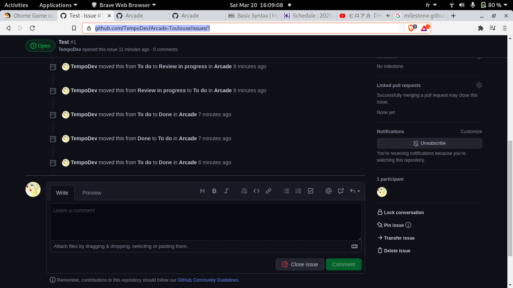

> [retour](https://github.com/TempoDev/Arcade-Toulouse)
# Comment proposer des idées / Débattre ?
Une proposition peut être faite en ouvrant une issue github, qui sera ensuite ajoutée directement au projet et créera une discution.

Un exemple d'issue est disponible [ici](https://github.com/TempoDev/Arcade-Toulouse/issues/1)

# Débattre et discuter
Vous pouvez aller dans l'onglet *Discussion* du repo pour parler et proposer divers choses pour l'arcade.
Vous pouvez créer de nouvelles dicussions et participer aux débats.

## Onglet discussion

1. Les différentes catégories du forum
    * Général : discussions générales
    * Ideas : pour proposer des idées
    * Questions : pour poser des questions
2. Les différentes conversations
3. Créer une nouvelles discussion
> /!\ Vous pouvez créer de nouvelles conversations dès que vous voulez aborder un sujet ou poser une question. Néanmoins merci d'éviter de dupliquer des conversations, au risque de noyer d'autres conversations importantes.

## page de discussion

Vous pouvez participer et répondre sur la page de discussion. proposez vos idées et ouvrez des issues lorsqu'une idée se précise.

jetez un oeil à la discussion principale [ici](https://github.com/TempoDev/Arcade-Toulouse/discussions/9).

# Créer une issue
## 1 - Ouvrez le panel des *Issues*

## 2 - Cliquez sur "*New Issue*"

## 3 - Créez votre issue

A. Remplissez **Titre** et **Description**.Vous pouvez ajouter des fichiers et formatter en *Markdown*.

B. Remplissez les informations additionnelles si besoin :
1. Assignez un responsable pour qu'il review et valide l'issue (facultatif).
2. Ajoutez des labels (flags) pour catégoriser l'issue.
3. Liez l'issue au projet de l'arcade.
4. Les milestones sont un regroupement d'issues, à utiliser lorsque plusieurs issues sont liées entre elles.
5. Il est possible de linker l'issue a une pull request, qui contient l'intégration de l'issue.

# Interagir avec l'issue

## La page du projet

Une fois ceci fait, une *carte* est créé automatiquement dans le projet **Arcade** ([onglet "projects" > "Arcade"](https://github.com/TempoDev/Arcade-Toulouse/projects/1)).
Il est possible sur cet écran d'avoir un aperçu global et rapide du projet et des issues.

## La page de l'issue

Une *page* pour l'issue est également créée automatiquement dans l'onglet issue. Elle donne **toutes les informations concernant l'issue**, sa progression, ses interaction et il est également possible de **débattre** dessus, ainsi que de s'inscrire à une issue pour **recevoir des notifications** la concernant.

# Faire une pull request
Une pull request est comme un commit mais qui attend l'approbation de quelqu'un ayant les droit du repo. Pour créer une pull request il faut tout d'abord *fork le repo* (faire une copie du repo) puis *commit un changement sur le fork* et enfin *créer la pull request*.

Plus d'information en suivant les liens suivants :

[Travailler avec des forks](https://docs.github.com/en/github/collaborating-with-issues-and-pull-requests/working-with-forks) 

[Créer une pull request](https://docs.github.com/en/github/collaborating-with-issues-and-pull-requests/creating-a-pull-request-from-a-fork)