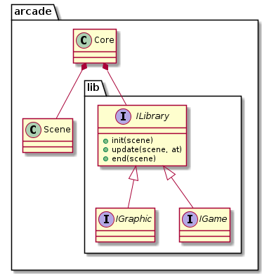

> [retour](https://github.com/TempoDev/Arcade-Toulouse)
# Documentation
Le principe de l'arcade commun est de faire un pseudo ECS (Entity-Component-System) en récupérant les données d'une lib graphique et d'une lib de jeu et des les associer pour faire un jeu.
## Architecture
L'architecture choisie de l'arcade est la suivante :


* Le **Core** est le centre de l'arcade, elle est la partie opaque et non commune du projet.
* L'interface **ILibrary** représente les librairies (les *.so).
* L'interface **IGame** représente les libs de jeu.
* L'interface **IGraphic** représente les libs graphiques.
* L'interface **IScene** contient la scene  avec lequels interagissent le jeu et la lib graphiques.

## Détails

### **ILibrary**

**ILibrary** Contient 3 méthodes :
* `init` qui se lance à "l'activation" de la librairie.
* `update` qui s'execute en boucle tant que la lib est active
* `end` qui s'execute à la fin de l'utilisation de la lib (lorsque celle-ci est désactivée).

### **api.h**

**api.h** est un fichier qui relie le core et les librairies. Elle contient 3 fonctions qui doivent être *appelé* par le *core* et **implémentés** par la **librairie**:

* `library_create` qui retourne une **instance** d'une classe qui hérite de `IGame` ou `IGraphic`.

```cpp
void *library_create()
{
    return new PacMan();
}
```

* `library_delete` qui efface **l'instance** créée par `library_create`.
```cpp
void library_delete(void *pacman)
{
    delete static_cast<PacMan>(pacman);
}
```
* `library_get_data` qui renvoie une structure `library_info_t` contenant des informations sur la librairie :
    * `enum type` [GAME|GRAPHIC] : défini le type de lib
    * `name` : le nom de la librairie
    * *[facultatif]* `date` : la date de la librairie 
    * *[facultatif]* `desc` : une description de la librairie

Certains champs sont facultatifs mais il serait bon d'au moins les mettre à 0 pour éviter les erreurs à ceux qui les utilisent (merci).

### **IGame**

**IGame** implémente 6 méthodes appelés lors d'évenements :
* `onKeyDown(const Key &key)` : on est en train d'appuyer sur une touche clavier (la touche *key*).
* `onKeyPressed(const Key &key)` : on vient d'appuyer sur une touche clavier (la touche *key*).
* `onKeyReleased(const Key &key)` : on vient de relacher une touche clavier (la touche *key*).


* `onMouseDown(const MouseEvent &mouse)` : on est en train d'appuyer sur un bouton de la souris (la structure *mouse* contient la position de la souris et le bouton préssé).
* `onMousePressed(const MouseEvent &mouse)` : on vient d'appuyer sur un bouton de la souris (la structure *mouse* contient la position de la souris et le bouton préssé).
* `onMouseReleased(const MouseEvent &mouse)` : on vient de relacher un bouton de la souris (la structure *mouse* contient la position de la souris et le bouton relàché).

Ceux sont des call back. Cela signifie qu'elle sont appelée à chaques fois que l'évenement a lieu, par le core. Elle est implémenté par **IGame** qui défini qu'elles actions ont lieu lorsque cette évenement est appelé.

### **keyboard.hpp**

**keyboard.hpp** est un fichier qui contient une énumération **`Key`** qui définie les touches du clavier. Elle est utilisé pour les événement du clavier.

### **Mouse.hpp**

**Mouse.hpp** est un fichier qui contient une structure **`MouseEvent`** qui définie un évenement souris.
Elle contient :
* `int x` : la position de la souris sur la longueur.
* `int y` : la position de la souris sur la hauter.
* `enum button` : le boutton concerné par l'événement :
    * `MOUSE_PRIMARY` : clic gauche
    * `MOUSE_SECONDARY` : clic droit
    * `MOUSE_AUXILIARY` : clic central